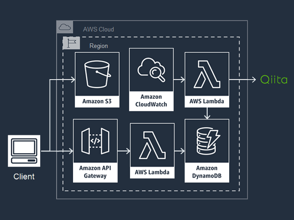

# Qiitaいいねランキング

## デモサイト
http://qiita-likes-rank.s3-website-ap-northeast-1.amazonaws.com/

## 作成者
Masahiro Kasatani

## システム構成図

## 動かしてみたい方へ
### config.iniは下記を参考に作成してください
https://godoc.org/gopkg.in/ini.v1  
### DynamoDBテーブル設計
パーティションキー：LikesRank  
ソートキー：Tag  
### APIGateway
CORSの有効化→デプロイを忘れずに